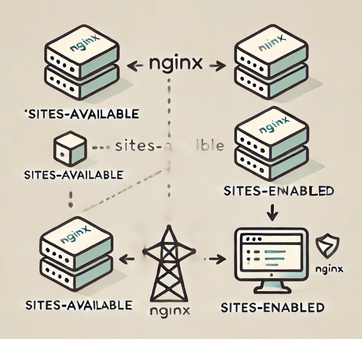

Postmortem Report: Service Outage on August 18, 2024
Issue Summary

Duration: August 18, 2024, 14:30 - 16:45 UTC
Impact: The primary website was inaccessible for approximately 50% of users. Affected users experienced 502 Bad Gateway errors.
Root Cause: A misconfigured load balancer rule caused an overload on the backend servers.
Timeline

    14:30 UTC: Outage detected through monitoring alerts indicating increased 502 error rates.
    14:32 UTC: Initial investigation revealed high latency in backend servers. Assumed to be a potential server performance issue.
    14:45 UTC: Investigation expanded to check Nginx and load balancer configurations. No immediate issues found.
    15:00 UTC: A customer complaint confirmed issues with accessing the website, prompting a deeper look into the load balancer settings.
    15:15 UTC: It was discovered that recent load balancer configuration changes led to improper traffic distribution. Load balancer was directing all traffic to a single server, causing overload.
    15:30 UTC: The issue was escalated to the DevOps team. They rolled back the recent configuration changes.
    15:45 UTC: Initial server overload issues were resolved. Further checks confirmed that the rollback restored normal operation.
    16:00 UTC: Verified that traffic was properly balanced and no further issues detected.
    16:45 UTC: Full resolution confirmed. All systems operational and monitoring in place to ensure stability.

Root Cause and Resolution

Root Cause: The load balancer configuration was updated to include new rules for traffic distribution. However, an error in these rules caused all traffic to be routed to a single backend server, which could not handle the increased load and resulted in 502 Bad Gateway errors.

Resolution:

    The faulty load balancer configuration was rolled back to the previous stable state.
    The traffic distribution was restored to ensure load was balanced correctly across all backend servers.
    Post-rollback, a thorough check confirmed the website was fully operational and traffic distribution was functioning as expected.

Corrective and Preventative Measures

Improvements:

    Review Load Balancer Changes: Implement a more rigorous review process for load balancer configuration changes.
    Increase Monitoring: Enhance monitoring on load balancer and backend server health to detect and address anomalies more quickly.
    Automated Rollbacks: Introduce automated rollback mechanisms for load balancer configurations to quickly revert to the last known good state.

Tasks:

    Patch Load Balancer Configuration: Review and correct the load balancer configuration rules to prevent recurrence.
    Update Monitoring System: Add specific alerts for load balancer traffic distribution issues.
    Conduct Post-Mortem Training: Train teams on the updated procedures and monitoring tools to prevent similar issues in the future.
    Document Configuration Changes: Ensure all load balancer configuration changes are documented and reviewed by multiple team members before deployment.

By addressing these areas, we aim to enhance the resilience of our infrastructure and improve our response to future incidents.

